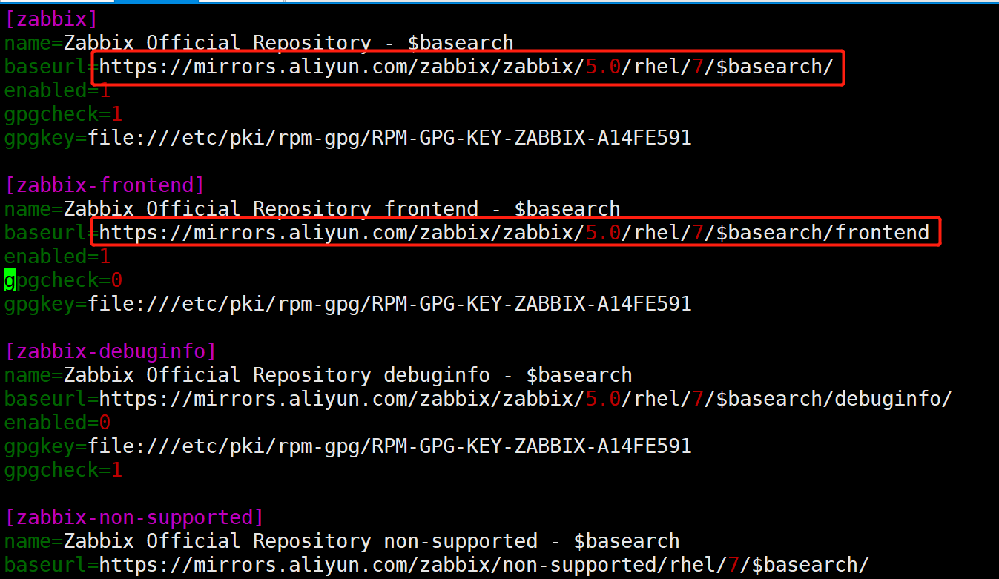
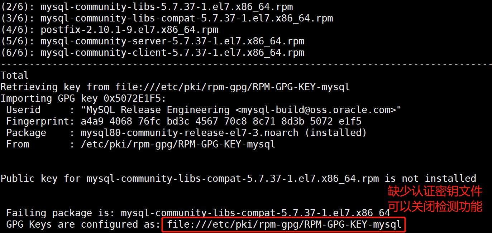
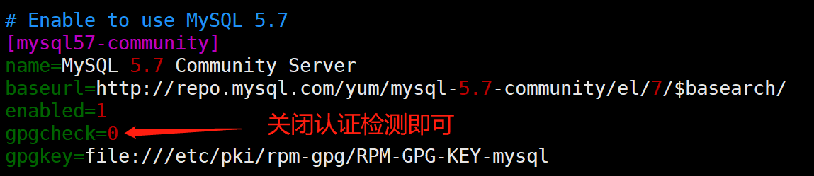
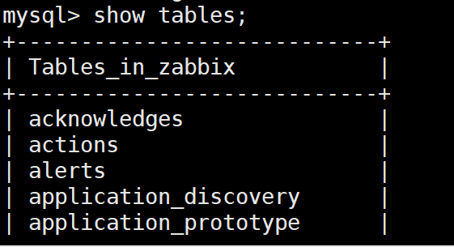

# 企业级Zabbix监控平台

## 监控的意义


我们如何及时的获得这些应用的运行状态信息，在出现问题时能够及时知道，这就是监控要做的事情


## 监控的对象


通常情况下，我们可以将监控对象这么来分：
1.服务器监控，主要监控服务器如：CPU 负载、内存使用率、磁盘使用率、登陆用户数、进程状态、网卡状态等。
2.应用程序监控，主要监控该应用程序的服务状态，吞吐率和响应时间，因为不同应用需要监控的对象不同，这里不一一列举。
3.数据库监控，只所以把数据库监控单独列出来，足以说明它的重要性，一般监控数据库状态，数据库表或者表空间的使用情况，是否有死锁，错误日志，性能信息等等。
4.网络监控，主要监控当前的网络状况，网络流量，端口，连接等。


## 监控软件


- zabbix

- prometheus

- nagios

- ganglia

- open-falcon

- cacti


   1.nagios图形不是特别好，也可以安装图形插件，但是仍然不够直观
   2.nagios一般情况下如果需要图形可以和cacti配合使用
   3.cacti的监控是轮询监控,效率低，图形相对nagios比较好看
   4.zabbix和nagios因为是并发监控，对cpu的要求更高
   5.zabbix在性能和功能上都强大很多
   6.zabbix的图形相当美观   

​    7.支持多种监控方式 zabbix-agent  snmp JVM等等
   8.支持分布式监控,能监控的agent非常多，丰富的监控模板
   9.zabbix有图形的web配置界面，配置简洁
   10.zabbix支持自动发现功能


## Zabbix应用手册


#### 1、Zabbix介绍


```plain
Zabbix 是一种企业级的分布式开源监控解决方案。

Zabbix 是一款能够监控众多网络参数和服务器的健康度和完整性的软件。Zabbix 使用灵活的通知机制，允许用户为几乎任何事件配置基于邮件的警报。这样可以快速响应服务器问题。Zabbix 基于存储的数据提供出色的报告和数据可视化。这些功能使得 Zabbix 成为容量规划的理想选择。

Zabbix 支持轮询和被动捕获。所有的 Zabbix 报告、统计信息和配置参数都可以通过基于 Web 的前端页面进行访问。基于 Web 的前端页面确保您的网络状态和服务器健康状况可以从任何地方进行评估。在经过适当的配置后，Zabbix 可以在监控 IT 基础设施方面发挥重要作用。无论是对于拥有少量服务器的小型组织，还是拥有大量服务器的大型公司而言，同样适用。

Zabbix 是开源的。Zabbix 是根据 GPL 通用公共许可证的第二版编写和分发的。这意味着它的源代码是免费开放的，并且可供公共使用。
```


Zabbix 优点

监控端（zabbix-server）

被监控（zabbix-agent1）

被监控（zabbix-agent2）


监控模板（包含：监控项：监控的指标   触发器：判断监控到的数据是否正常）

```shell
-  开源,无软件成本投入
-  Server 对设备性能要求低
-  支持设备多,自带多种监控模板
-  支持分布式集中管理,有自动发现功能,可以实现自动化监控
-  当监控项比较多,服务器队列比较大时可以采用被动模式,被监控端主动从监控端去下载需要监控的item 然后取数据上传到监控端。 这种方式对监控端的负载比较小。
-  Api接口的支持,方便与其他系统结合
```


Zabbix 缺点


zabbix-server(Mysql5.7)  zabbix-agent


```plain
-  需在被监控主机上安装 agent,所有数据都存在数据库里, 产生的数据据很大,瓶颈主要在数据库。
-  项目批量修改不方便   
-  系统级别报警设置相对比较多，如果不筛选的话报警邮件会很多；并且自定义的项目报警需要自己设置，过程比较繁琐；
-  缺少数据汇总功能，如无法查看一组服务器平均值，需进行二次开发；
```


#### 2、Zabbix功能


[**数据采集**](https://www.zabbix.com/documentation/5.0/manual/config/items)


- 可用性和性能采集；

- 支持 SNMP（包括主动轮询和被动捕获）、IPMI、JMX、VMware 监控；

- 自定义检查；

- 按照自定义的时间间隔采集需要的数据；

- 通过 Server/Proxy 和 Agents 来执行数据采集。


[**灵活的阈值定义**](https://www.zabbix.com/documentation/5.0/manual/config/triggers)


- 您可以定义非常灵活的告警阈值，称之为触发器，触发器从后端数据库获得参考值。


[**高度可配置化的告警**](https://www.zabbix.com/documentation/5.0/manual/config/notifications)


- 可以根据递增计划、接收者、媒介类型自定义发送告警通知；

- 使用宏变量可以使告警通知变得更加高效有益；

- 自动动作包含远程命令。


[**实时图形**](https://www.zabbix.com/documentation/5.0/manual/config/visualization/graphs/simple)


- 使用内置图形功能可实以将监控项绘制成图形。


[**Web 监控功能**](https://www.zabbix.com/documentation/5.0/manual/web_monitoring)


- Zabbix 可以追踪模拟鼠标在 Web 网站上的点击操作，来检查 Web 网站的功能和响应时间。


[**丰富的可视化选项**](https://www.zabbix.com/documentation/5.0/manual/config/visualization)


- 能够创建可以将多个监控项组合到单个视图中的自定义图形；

- 网络拓扑图；

- 以仪表盘样式展示自定义聚合图形和幻灯片演示；

- 报表；

- 监控资源的高层次（业务）视图。


[**历史数据存储**](https://www.zabbix.com/documentation/5.0/manual/installation/requirements#database_size)


- 存储在数据库中的数据；

- 可配置的历史数据；

- 内置数据管理机制（housekeeping）。


[**配置简单**](https://www.zabbix.com/documentation/5.0/manual/config/hosts)


- 将被监控设备添加为主机；

- 主机一旦添加到数据库中，就会采集主机数据用于监控；

- 将模板用于监控设备。


[**套用模板**](https://www.zabbix.com/documentation/5.0/manual/config/templates)


- 在模板中分组检查；

- 模板可以关联其他模板，获得继承。


[**网络发现**](https://www.zabbix.com/documentation/5.0/manual/discovery)


- 自动发现网络设备；

- Zabbix Agent 发现设备后自动注册；

- 自动发现文件系统、网络接口和 SNMP OIDs 值。


[**快捷的 Web 界面**](https://www.zabbix.com/documentation/5.0/manual/web_interface)


- 基于 PHP 的 Web 前端；

- 可以从任何地方访问；

- 您可以定制自己的操作方式；

- 审计日志。


[**Zabbix API**](https://www.zabbix.com/documentation/5.0/manual/api)


- Zabbix API 为 Zabbix 提供可编程接口，用于批量操作、第三方软件集成和其他用途。


[**权限管理系统**](https://www.zabbix.com/documentation/5.0/manual/config/users_and_usergroups)


- 安全的用户身份验证；

- 将特定用户限制于访问特定的视图。


[**功能强大且易于扩展的 Zabbix Agent**](https://www.zabbix.com/documentation/5.0/manual/concepts/agent)


- 部署于被监控对象上；

- 完美支持 Linux 和 Windows ；


[**二进制守护进程**](https://www.zabbix.com/documentation/5.0/manual/concepts/server)


- 为了更好的性能和更少的内存占用，采用 C 语言编写；

- 便于移植。


[**适应更复杂的环境**](https://www.zabbix.com/documentation/5.0/manual/distributed_monitoring)


- 使用 Zabbix Proxy 代理，可以轻松实现分布式远程监控。


#### 3、ZABBIX 概述


##### 架构


Zabbix 由几个主要的功能组件组成，其职责如下所示。


##### SERVER


Zabbix server 是 Zabbix agent 向其报告可用性、系统完整性信息和统计信息的核心组件。是存储所有配置信息、统计信息和操作信息的核心存储库。


##### 数据库


所有配置信息以及 Zabbix 收集到的数据都被存储在数据库中。


##### WEB 界面


为了从任何地方和任何平台轻松访问 Zabbix ，我们提供了基于 web 的界面。该界面是 Zabbix server 的一部分，通常（但不一定）和 Zabbix server 运行在同一台物理机器上。


##### PROXY


Zabbix proxy可以替 Zabbix server 收集性能和可用性数据。Zabbix proxy 是 Zabbix 环境部署的可选部分；然而，它对于单个 Zabbix server 负载的分担是非常有益的。


##### AGENT


[Zabbix agents](https://www.zabbix.com/documentation/5.0/manual/concepts/agent) 部署在被监控目标上，用于主动监控本地资源和应用程序，并将收集的数据发送给 Zabbix server。


##### 数据流


此外，重要的是，需要回过头来了解下 Zabbix 内部的整体数据流。首先，为了创建一个采集数据的监控项，您就必须先创建主机。其次，必须有一个监控项，然后创建触发器。最后，您必须有一个触发器来触发一个动作，这几个点构成了一个完整的数据流。因此，如果您想要收到 CPU load it too high on *Server X* 的告警，您必须首先为 *Server X* 创建一个主机条目，其次创建一个用于监视其 CPU 的监控项，最后创建一个触发器，用来触发 CPU is too high 这个动作，并将其发送到您的邮箱里。虽然这些步骤看起来很繁琐，但是使用模板的话，其实并不复杂。也正是由于这种设计，使得 Zabbix 的配置变得更加灵活易用。


#### 4、Zabbix定义


**主机（host）**


你想要监控的联网设备，有IP/DNS。


[***主机组（host group)***](https://www.zabbix.com/documentation/5.0/manual/config/hosts)


主机的逻辑组；可能包含主机和模板。一个主机组里的主机和模板之间并没有任何直接的关联。通常在给不同用户组的主机分配权限时候使用主机组。


[***监控项（item）***](https://www.zabbix.com/documentation/5.0/manual/config/items)


你想要接收的主机的特定数据，一个度量/指标数据。


[***值预处理（value preprocessing）***](https://www.zabbix.com/documentation/5.0/manual/config/items/item#item_value_preprocessing)


转化/预处理接收到的指标数据* 存入数据库之前


[触发器（trigger）](https://www.zabbix.com/documentation/5.0/manual/config/triggers)


一个被用于定义问题阈值和“评估”监控项接收到的数据的逻辑表达式


当接收到的数据高于阈值时，触发器从“OK”变成“Problem”状态。当接收到的数据低于阈值时，触发器保留/返回“OK”的状态。


[***事件（event）***](https://www.zabbix.com/documentation/5.0/manual/config/events)


一次发生的需要注意的事情，例如触发器状态改变、发现/监控代理自动注册


[***事件标签（event tag）***](https://www.zabbix.com/documentation/5.0/manual/config/triggers/event_tags)


提前设置的事件标记*可以被用于事件关联，权限细化设置等。


[***事件关联（event correlation）***](https://www.zabbix.com/documentation/5.0/manual/config/event_correlation)


自动灵活的、精确的关联问题和解决方案


比如说，你可以定义触发器A告警的异常可以由触发器B解决，触发器B可能采用完全不同的数据采集方式。


[***异常（problems）***](https://www.zabbix.com/documentation/5.0/manual/web_interface/frontend_sections/monitoring/problems)


一个处在“异常”状态的触发器


[***异常更新（problem update）***](https://www.zabbix.com/documentation/5.0/manual/acknowledges#updating_problems)


Zabbix提供的问题管理选项，例如添加评论、确认异常、改变问题级别或者手动关闭等。


[***动作（action）***](https://www.zabbix.com/documentation/5.0/manual/config/notifications/action)


预先定义的应对事件的操作


一个动作由操作(例如发出通知)和条件(什么时间进行操作)组成


[***升级（escalation）***](https://www.zabbix.com/documentation/5.0/manual/config/notifications/action/escalations)


一个在动作内执行操作的自定义方式; 发送通知/执行远程命令的顺序安排。


[***报警媒介（media）***](https://www.zabbix.com/documentation/5.0/manual/config/notifications/media)


发送告警通知的方式；传送途径


[***通知（notification）***](https://www.zabbix.com/documentation/5.0/manual/config/notifications/action/operation/message)


关于事件的信心，将通过选设定的媒介途径发送给用户。


[***远程命令（remote command）***](https://www.zabbix.com/documentation/5.0/manual/config/notifications/action/operation/remote_command)


一个预定义好的，满足特定条件的情况下，可以在被监控主机上自动执行的命令。


[***模版（template）***](https://www.zabbix.com/documentation/5.0/manual/config/templates)


一组可以被应用到一个或多个主机上的实体（监控项，触发器，图形，聚合图形，应用，LLD，Web场景）的集合


模版的应用使得主机上的监控任务部署快捷方便；也可以使监控任务的批量修改更加简单。模版是直接关联到每台单独的主机上。


[***应用（application）***](https://www.zabbix.com/documentation/5.0/manual/config/items/applications)


一组监控项组成的逻辑分组


[***Web场景（web scenario）***](https://www.zabbix.com/documentation/5.0/manual/web_monitoring)


检查网站可浏览性的一个或多个HTTP请求


[***前端（frontend)***](https://www.zabbix.com/documentation/5.0/manual/introduction/overview#architecture)


Zabbix提供的web界面


[***Zabbix API***](https://www.zabbix.com/documentation/5.0/manual/api)


\- *Zabbix API允许用户使用JSON RPC协议来创建、更新和获取Zabbix对象（如主机、监控项、图形和其他）信息或者执行任何其他的自定义的任务*


[***Zabbix server***](https://www.zabbix.com/documentation/5.0/manual/concepts/server)


Zabbix监控的核心程序，主要功能是与Zabbix proxies和Agents进行交互、触发器计算、发送告警通知；并将数据集中保存等


[***Zabbix agent***](https://www.zabbix.com/documentation/5.0/manual/concepts/agent)


部署在监控对象上的，能够主动监控本地资源和应用的程序


[***Zabbix proxy***](https://www.zabbix.com/documentation/5.0/manual/concepts/proxy)


一个帮助Zabbix Server收集数据，分担Zabbix Server的负载的程序


[***加密（encryption）***](https://www.zabbix.com/documentation/5.0/manual/encryption)


支持Zabbix组建之间的加密通讯(server, proxy, agent, zabbix_sender 和 zabbix_get 程序)使用TLS（Transport Layer Security ）协议。


5、Zabbix监控架构


a.分布式监控 (企业常用) server-proxy-agent


b.server-anget(点对点监控)


监控报警流程图：


#### 5、Zabbix 监控系统监控对象


- 数据库：  MySQL,MariaDB,Oracle,SQL Server     agent

- 应用软件：Nginx,Apache,PHP,Tomcat           agent
  \-------------------------------------------------------------------------------------------------------------------------------

- 集群：    LVS,Keepalived,HAproxy,RHCS,F5     agent

- 虚拟化：  VMware,KVM,XEN ,docker,k8s        agent

- 操作系统：Linux,Unix,Windows性能参数        agent
  \-------------------------------------------------------------------------------------------------------------------------------

- 硬件： 服务器，存储，网络设备                IPMI

- 网络： 网络环境（内网环境，外网环境）        SNMP
  \-------------------------------------------------------------------------------------------------------------------------------


IPMI:**智能平台管理接口**（Intelligent Platform Management Interface）IPMI 能够横跨不同的操作系统、固件和硬件平台，可以智能的监视、控制和自动回报大量服务器的运作状况，以降低服务器系统成本。


SNMP：网络管理协议（[SNMP](https://baike.baidu.com/item/SNMP/133378)） 是专门设计用于在 IP 网络管理[网络节点](https://baike.baidu.com/item/网络节点/9338583)（[服务器](https://baike.baidu.com/item/服务器/100571)、[工作站](https://baike.baidu.com/item/工作站/217955)、[路由器](https://baike.baidu.com/item/路由器/108294)、[交换机](https://baike.baidu.com/item/交换机/103532)等）的一种标准协议，它是一种[应用层](https://baike.baidu.com/item/应用层)协议。


#### 6、Zabbix监控方式


##### 被动模式


- 被动检测：相对于agent而言；agent, **server向agent请求获取配置的各监控项相关的数据**，agent接收请求、获取数据并响应给server；


##### 主动模式


-  主动检测：相对于agent而言；agent(active),**agent向server请求与自己相关监控项配置**，主动地将server配置的监控项相关的数据发送给server； 

-  主动监控能极大节约监控server 的资源。 
   Zabbix由几个主要的软件组件构成，这些组件的功能如下。
    

##### Zabbix 架构


## 安装和配置 Zabbix 服务


##### 实验准备


Centos7.4 系统服务器3台、 一台作为监控服务器， 两台台作为被监控节点， 配置好yum源、 防火墙关闭、 各节点时钟服务同步、 各节点之间可以通过主机名互相通信。
**1）所有机器关闭防火墙和selinux**


```shell
setenforing 0 （修改配置文件关闭）
sed -i 's/SELINUX=enforcing/SELINUX=disabled/' /etc/selinux/config 
systemctl stop firewalld.service
```


**2）根据架构图，实验基本设置如下：**

| 机器名称 | IP配置          | 服务角色           | 备注 |
| -------- | --------------- | ------------------ | ---- |
| server   | 192.168.153.147 | zabbix-server      | 开启 |
| node1    | 192.168.153.178 | zabbix-agent-node1 | 开启 |
| node2    | 192.168.153.179 | zabbix-agent-node2 | 开启 |


##### 1. 安装 Zabbix 存储库


[文档](https://www.zabbix.com/documentation/5.0/manual/installation/install_from_packages)


```shell
[root@zabbix-server ~]# rpm -Uvh https://repo.zabbix.com/zabbix/5.0/rhel/7/x86_64/zabbix-release-5.0-1.el7.noarch.rpm
# 如果安装失败，断开无线网，用手机热点进行尝试
或者执行
rpm -Uvh https://mirrors.aliyun.com/zabbix/zabbix/5.0/rhel/7/x86_64/zabbix-release-5.0-1.el7.noarch.rpm
```

##### 替换国内阿里云yum源

由于用zabbix官网网络Yum源下载速度比较慢，我这里替换为阿里云源

```shell
[root@zabbix-server ~]# sed -i 's#http://repo.zabbix.com#https://mirrors.aliyun.com/zabbix#' /etc/yum.repos.d/zabbix.repo
```



##### 2. 安装 Zabbix 服务器和代理


```shell
[root@zabbix-server ~]# yum install zabbix-server-mysql zabbix-agent -y
```


##### 3. 安装 Zabbix 前端


[文档](https://www.zabbix.com/documentation/5.0/manual/installation/frontend/frontend_on_rhel7)


启用红帽软件集合


```shell
[root@zabbix-server ~]# yum install centos-release-scl -y
这里下载的是个zabbix相关的yum源，才能继续下载其他的软件包
```


编辑文件 /etc/yum.repos.d/zabbix.repo 并启用 zabbix-frontend 存储库。


```plain
[zabbix-frontend]
...
enabled=1
...
```


安装 Zabbix 前端包


```shell
[root@zabbix-server ~]# yum -y install zabbix-web-mysql-scl zabbix-apache-conf-scl
```


##### 4. 创建初始数据库


[文档](https://www.zabbix.com/documentation/5.0/manual/appendix/install/db_scripts)


确保您已启动并运行数据库服务器。这里我使用的是Mysql5.7版本


```shell
[root@zabbix-server ~]# wget https://dev.mysql.com/get/mysql80-community-release-el7-3.noarch.rpm
[root@zabbix-server ~]# rpm -ivh mysql80-community-release-el7-3.noarch.rpm
```


打开/etc/yum.repos.d的mysql-community.repo


打开5.7源地址，关闭8.0源地址，确保下载的数据库是mysql5.7；这里换mariadb也可以


```shell
[root@zabbix-server ~]# yum -y install mysql-community-server
```


如果下载过程报下面错误：








然后重新下载即可


因为mysql5.7启动，root用户会生成随机密码，可以进行修改


```shell
[root@zabbix-server ~]# systemctl start mysqld
[root@zabbix-server ~]# grep 'password' /var/log/mysqld.log
```


```shell
[root@zabbix-server ~]# mysqladmin -uroot -p'U84zCRrlt0=c' password 'asuka@2021'
```


在您的数据库主机上运行以下命令。


```plain
[root@zabbix-server ~]# mysql -uroot -p'asuka@2021'
mysql> create database zabbix character set utf8 collate utf8_bin;
mysql> grant all on zabbix.* to zabbix@localhost identified by '123';
mysql> flush privileges;
mysql> quit;
```


在 Zabbix 服务器主机上导入初始模式和数据。系统将提示您输入新创建的密码。


```shell
[root@zabbix-server ~]# zcat /usr/share/doc/zabbix-server-mysql*/create.sql.gz | mysql -uzabbix -p zabbix
Enter password: //此处输入上面创建用户时，设置的密码，回车导入数据；
```


可再次进去到数据库，确认zabbix库中有数据生成；


```plain
mysql> show databases;
+--------------------+
| Database           |
+--------------------+
| information_schema |
| mysql              |
| performance_schema |
| sys                |
| zabbix             |
+--------------------+
mysql> use zabbix
```





##### 5. 为 Zabbix 服务器配置数据库


编辑文件 /etc/zabbix/zabbix_server.conf


```shell
DBHost=localhost
DBName=zabbix
DBUser=zabbix
DBPassword=123
```


##### 6. 为 Zabbix 前端配置 PHP


编辑文件/etc/opt/rh/rh-php72/php-fpm.d/zabbix.conf，取消注释并为您设置正确的时区。


```shell
php_value[date.timezone] = Asia/Shanghai
```


##### 7. 启动 Zabbix 服务器和代理进程


启动 Zabbix 服务器和agent代理进程并使其在系统启动时启动。


```shell
[root@zabbix-server ~]# systemctl restart zabbix-server zabbix-agent httpd rh-php72-php-fpm
[root@zabbix-server ~]# systemctl enable zabbix-server zabbix-agent httpd rh-php72-php-fpm
```


##### 8. 配置 Zabbix 前端


连接到您新安装的 Zabbix 前端：


http:// 192.168.153.147/zabbix
按照 Zabbix 文档中描述的步骤： [安装前端](https://www.zabbix.com/documentation/5.0/manual/installation/install#installing_frontend)


出现以下登录界面，


Zabbix监控平台有默认管理员用户；


默认用户名Admin，密码为zabbix；


页面显示为英文，可以设置为中文


Admin用户，可以设置任何用户的语言


设置自己的语言如下图


设置其他用户的语言如下图：


修改为如下，即可：


### 配置被监控zabbix-agent


当我们把监控端配置启动以后，我们需要来设置一下我们的被监控端，我们在被监控的主机安装好zabbix-agent，设置好他的所属的监控端server，并把他添加到server端，就能将其纳入我们的监控系统中去了。


##### 1）安装 zabbix 源

```shell
rpm -Uvh https://mirrors.aliyun.com/zabbix/zabbix/5.0/rhel/7/x86_64/zabbix-release-5.0-1.el7.noarch.rpm
sed -i 's#http://repo.zabbix.com#https://mirrors.aliyun.com/zabbix#' /etc/yum.repos.d/zabbix.repo
```


```shell
[root@zabbix-agent-node1 ~]# rpm -Uvh https://repo.zabbix.com/zabbix/5.0/rhel/7/x86_64/zabbix-release-5.0-1.el7.noarch.rpm
[root@zabbix-agent-node1 ~]# yum install zabbix-agent zabbix-sender -y
```


##### 2）修改配置文件


对配置文件做一个备份，然后去修改配置文件：


```shell
[root@zabbix-agent-node1 ~]# cd /etc/zabbix/
[root@zabbix-agent-node1 zabbix]# cp zabbix_agentd.conf zabbix_agentd.bak
[root@zabbix-agent-node1 zabbix]# ls
zabbix_agentd.bak  zabbix_agentd.conf  zabbix_agentd.d
[root@zabbix-agent-node1 zabbix]# vim zabbix_agentd.conf   ----修改如下
Server=192.168.153.147 zabbix监控端的地址 
ServerActive=192.168.153.147 主动模式 zabbix-server-ip
Hostname=zabbix-agent-none1 
UnsafeUserParameters=1 是否限制用户自定义 keys 使用特殊字符 1是可以启用特殊字符 0是不可以启用特殊字符
EnableRemoteCommands=1 是否允许别人执行远程操作命令，默认是禁用的，打开的话会有安全风险.
```


是否允许别人执行远程操作命令，默认是禁用的，打开的话会有安全风险.


修改完成之后，我们保存退出。然后就可以启动服务了：


```plain
[root@zabbix-agent-node1 zabbix]# systemctl start zabbix-agent
[root@zabbix-agent-node1 zabbix]# systemctl enable zabbix-agent
```


##### 3）创建主机群组


可以看到Zabbix本身就有很多默认的主机群组。暂时不用理会


##### 4）创建主机


##### 5）创建应用集


应用集，可以认为是监控项的分类

应用集：

nginx-status

mysql-status

监控项：

nginx 连接数

nginx 吞吐量

nginx 失败连接数

mysql主从复制状态

mysql当前连接数

mysql每秒查询次数


应用集可以有多个，我们再创建2个，这里不再给予创建过程；


##### 6）创建监控项


要在Zabbix管理页面创建一个监控项，请执行以下操作：


- 进入到: *配置* → *主机*

- 在主机所在的行单击 *监控项*

- 点击屏幕右上角的*创建监控项*

- 输入表单中监控项的参数


你也可以打开一个已经存在的监控项，点击*克隆* 按钮，然后重命名保存。


任何一个被监控项，如果想要能够被监控，一定要在zabbix-server端定义了能够连接至zabbix-agent端，并且能够获取命令。或者在agent端定义了能够让server端获取命令。一般都是内建的命令，都对应的有其名字，被我们称之为`key`。


###### a.创建1个不带参数的监控项：


监控系统已启动的时间


关于键值(key值)，我们可以直接在网页上设置(服务器自动执行)，


但是最好提前使用命令行命令(手动执行)来获取，确保此监控项的键值能取到监控数据，也就意味着能监控到此指标；


```shell
[root@zabbix-server ~]# yum -y install zabbix-get
[root@zabbix-server ~]# zabbix_get -s 192.168.153.178 -k  system.uptime -p 10050
8429
```


如果能获取到值，就可以点击添加了；等待一会儿，点击“监测”-->“最新数据”


即可看到被监控端node1的已运行时间；


也可点击自带的“图形”，看到整体情况


###### b.创建1个带参数的监控项


案例2：**监控文件的大小**


被监控端node1先创建出1G文件


```shell
[root@zabbix-agent-node1 ~]# dd if=/dev/zero of=/home/test.txt bs=1M count=1024
[root@zabbix-agent-node1 ~]# ll -h /home/
-rw-r--r--. 1 root root 1.0G 6月  10 11:22 test.txt
```


去监控平台，创建监控项：


点击“最新数据”


案例3：**监控cpu负载**


关于key值，我们可以直接在网页上设置(服务器自动执行)，也可以使用命令行命令(手动执行)来获取：


```shell
[root@zabbix-server ~]# zabbix_get -s 192.168.153.178 -k  "system.cpu.load[all,avg5]" -p 10050
0.060000
```


案例4：**监控tcp的80端口是否存活**


被监控端，先下载占用80端口的服务，比如httpd或者nginx，tcp协议占用80端口的应用，都可以；


```plain
[root@zabbix-agent-node1 ~]# yum -y install httpd
[root@zabbix-agent-node1 ~]# systemctl start httpd
```


来到监控平台，创建对应监控项：


然后去“最新数据”中，查看


点击“图形”


##### 7）删除监控项


如果有一个监控项，我们用不上了，就可以删除掉。但是如果你直接删除的话，默认数据是会留下的，所以我们要先清除数据，然后再删除。


-  历史数据（history）和趋势数据（trends）是Zabbix中存储收集到的数据的两种方式。 

-  历史数据：每一个收集到的监控数据 

-  趋势数据：按小时统计计算的平均值数据 


强烈建议将历史数据保留时长设置得尽可能的小。这么做可以让数据库不会因存储了大量的历史数据，导致超负荷运行。


可以选择长时间的保留趋势数据，来替代长期需要的历史数据。例如：设置成保留14天历史数据和5年的趋势数据。


```plain
作业：监控cpu的平均负载，平均1分钟，5分钟，15分钟
```


##### 8）创建触发器（trigger）


触发器就是来判断监控项监控到的数据，是否处于合理区间的；


① 简介


当我们的采集的值定义完了以后，就可以来定义触发器了。
　　我们触发器的定义是：**界定某特定的监控项采集到的数据的非合理区间或非合理状态。通常为逻辑表达式。**


```shell
一般，我们评定采样数值是否为合理区间的比较稳妥的方法是——根据最后N次的平均值来判定结果；这个最后N次通常有两种定义方式：
1. 最近N分钟所得结果的平均值
2. 最近N次所得结果的平均值
```


**注：能用数值保存的就不要使用字符串**


② 触发器表达式


基本的触发器表达式格式如下所示


```plain
{<server>:<key>.<function>(<parameter>)}<operator><constant>
```


- `server`：主机名称；

- `key`：主机上关系的相应监控项的key；

- `function`：评估采集到的数据是否在合理范围内时所使用的函数,目前触发器所支持的函数有avg(平均)、count(计数)、change(变化)、date(日期)、dayofweek(星期)、delta(增量)、diff、iregexp、last()、max(最大值)、min(最小值)、nodata(无数据)、now(现在)、sum(总和)等

- `parameter`：函数参数；大多数数值函数可以接受秒数为其参数，而如果在数值参数之前使用“#”做为前缀，则表示为最近几次的取值，如sum(300)表示300秒内所有取值之和，而sum(#10)则表示最近10次取值之和；


配置一个触发器，进行下面步骤：


- 进入： *配置* → *主机*

- 点击主机一行的 *触发器*

- 点击右上角的 *创建触发器* （或者点击触发器名称去修改一个已存在的触发器）

- 在窗口中输入触发器的参数


测试触发器是否生效


被监控端停止httpd服务，意味着80端口也会关闭


```plain
[root@zabbix-agent-node1 ~]# systemctl stop httpd
```


##### 9）创建动作（action）


配置动作，步骤如下：


- 转到 *配置 - > 操作*

- 从页面标题下拉菜单中选择所需的动作类型

- 点击 *创建动作*

- 给动作命名

- 选择执行操作的 条件

- 选择要执行的 操作


我们可以看出，还需要在虚拟机上进行两项操作，一是修改sudo配置文件使zabbix用户能够临时拥有管理员权限；二是修改zabbix配置文件使其允许接收远程命令。我们进行如下操作：


```shell
[root@zabbix-agent1 zabbix]# setenforce 0
[root@zabbix-agent1 zabbix]# getenforce
Permissive
```


```shell
[root@zabbix-agent-node1 ~]# visudo          #相当于“vim /etc/sudoers”
    ## Allow root to run any commands anywhere
    root    ALL=(ALL)   ALL
    zabbix    ALL=(ALL)   NOPASSWD:ALL     #添加的一行，表示不需要输入密码

[root@zabbix-agent-node1 ~]# vim /etc/zabbix/zabbix_agentd.conf
    EnableRemoteCommands=1          #允许接收远程命令
    LogRemoteCommands=1             #把接收的远程命令记入日志

[root@zabbix-agent-node1 ~]# systemctl restart zabbix-agent.service
```


测试动作是否执行：


在被监控端，将httpd服务停止，查看是否会重启


```plain
[root@zabbix-agent-node1 ~]# systemctl stop httpd
```


等待一会儿，可看到，问题已被解决


被监控端查看httpd服务状态，也可看到httpd服务已被重启


刚刚一旦发生问题，我们添加了第一步需要做的事情，也就是重启服务，如果重启不成功怎么办呢？我们就需要来添加第二步：


第二步，可以是发送邮件，让我们及时知道问题仍然存在，然后人工介入紧急处理；


邮箱报警，需要创建媒介


邮箱类型有很多种，比如QQ邮箱，阿里云邮箱，163邮箱等；想用邮箱接收报警，要开启邮箱的SMTP服务


我们这里用QQ邮箱：


开启邮箱POP3/SMTP服务


往下拉取


需要已绑定的手机号码，发送短信开启


##### 10）创建媒介


媒介是Zabbix中用于发送通知和告警的传输通道。


问题发现邮件内容：


问题恢复邮件内容：


测试媒介是否可用:


前往QQ邮箱查看：


然后前往“动作”–>“操作”，进行设置


问题恢复，执行动作


将Admin用户和local_email媒介进行关联


测试：


```shell
[root@zabbix-agent-node1 ~]# systemctl stop httpd
```


一旦停止httpd。zabbix平台就会发现问题，随即执行第1步，重启了httpd，重启成功。不会有第2步


一旦httpd恢复正常，恢复操作会执行第1步，发送邮件，如下图


