# Zabbix邮箱自动监控报警实战

## 使用mailx给邮件发送信息

```shell
步骤：
1、下载mailx、关闭postfix服务
2、配置公网邮箱信息(邮箱地址、smtp服务器、用户名、邮箱的授权码)
3、echo方式发送、手动方式发送
```

```shell
监控端测试邮箱
server服务端
阿里云的yum源可以下载
[root@zabbix-server ~]# yum install mailx -y
[root@zabbix-server ~]# mailx -V 
12.5 7/5/10
注：使用新的方式--利用公网邮件服务器发送报警，需要关闭postfix服务
[root@zabbix-server ~]# systemctl stop postfix
```

```shell
配置公网邮箱信息
[root@zabbix-server ~]# vim /etc/mail.rc  ---在最后添加如下

set from=asukaasukaeva@163.com（邮箱地址） 
set smtp=smtp.163.com（smtp服务器） 
set smtp-auth-user=asukaasukaeva@163.com(用户名) 
set smtp-auth-password=TBELSWWIEOYTKPYF（这里是邮箱的授权密码） 
set smtp-auth=login
```

```shell
使用mailx发邮件的方式：
方式1：echo "正文内容" | mailx -s "邮件标题" 收件箱Email
方式2：mailx -s "邮件标题" 收件箱Email，回车按CTRL+D发送
参数：
-v ：显示发送的详细信息
```

```shell
手动发送邮件测试：
[root@zabbix-server ~]# mailx -v -s 'hello' 'asukaasukaeva@163.com'
123
123
EOT
手写邮件内容 （回车，然后ctrl+d正常结束)
```


## zabbix添加邮件报警功能

```shell
注：脚本名称任意，存放于/usr/lib/zabbix/alertscripts
(生产上的测试服放这：/usr/local/zabbix/share/zabbix/alertscripts）
```

```shell
名称：sendmail.sh                   //名称任意
类型：脚本
脚本名称：sendmail.sh      
脚本参数：                          //一定要写，否则可能发送不成功
    {ALERT.SENDTO}              //照填，收件人变量
    {ALERT.SUBJECT}             //照填，邮件主题变量，变量值来源于‘动作’中的‘默认接收人’
    {ALERT.MESSAGE}           //照填，邮件正文变量，变量值来源于‘动作’中的‘默认信息’

配置完成后,不要忘记点击存档,保存你的配置。
```


```plain
默认信息：邮件的主题
主机: {HOST.NAME1}
时间: {EVENT.DATE} {EVENT.TIME}
级别: {TRIGGER.SEVERITY}
触发: {TRIGGER.NAME}
详情: {ITEM.NAME1}:{ITEM.KEY1}:{ITEM.VALUE1}
状态: {TRIGGER.STATUS}
项目：{TRIGGER.KEY1}
事件ID：{EVENT.ID}
```


## zabbix通过脚本功能发送邮件

```shell
修改zabbix服务端配置文件＆编写脚本：指定脚本的存储路径:
[root@zabbix-server ~]# vim /etc/zabbix/zabbix_server.conf
 AlertScriptsPath=/usr/lib/zabbix/alertscripts
```


```shell
编写邮件脚本:
脚本仍是发送邮件，只不过换了1种方式
[root@zabbix-server ~]# cd /usr/lib/zabbix/alertscripts/
[root@zabbix-server alertscripts]# vim sendmail.sh
#!/bin/bash 
#export.UTF-8
echo "$3" | sed s/'\r'//g | mailx -s "$2" $1

$1:接受者的邮箱地址：sendto
$2:邮件的主题：subject
$3:邮件内容：message
```

```plain
监控端测试：
[root@zabbix-server alertscripts]# echo 'asuka' | mailx -s nihao asukaasukaeva@163.com
```


```shell
修改权限：
[root@zabbix-server alertscripts]# chmod u+x sendmail.sh && chown zabbix.zabbix sendmail.sh
或者：
[root@zabbix-server alertscripts]# chmod +x sendmail.sh
```

## zabbix通过脚本自动报警实战

```shell
步骤：
1、 报警媒介(Media)
2、 触发器(Triggers)
3、 动作(Action)
```

```shell
修改admin用户的报警媒介：
用户默认是没有关联报警媒介的，设置后就可以接收报警消息了。
接下来,设置接受报警用户的电子邮件
点击用户设置
点击：管理->报警媒介类型->Admin->报警媒介->添加
```


```shell
此时我们的node2节点上，有监控80端口的监控项，有关联到此监控项的触发器，还缺1个动作
```

```shell
创建动作：
```


```shell
被监控端进行测试
[root@zabbix-agent-node2 ~]# systemctl stop httpd
可以看到，Zabbix检测到问题之后，会执行动作
```


```shell
报警邮件接收成功：
```


```shell
[root@zabbix-agent-node2 ~]# systemctl start httpd
可看到，问题已恢复
```


```shell
恢复邮件接收成功
```


# Zabbix 钉钉自动监控报警

```shell
步骤：
1、创建钉钉报警机器人
2、安装python3环境
3、创建报警脚本
4、安装python-pip和requests库
5、测试脚本是否可行
   创建新的报警媒介
   关联媒介
   创建监控项
   创建触发器
   设置动作
   钉钉报警测试
```


## 创建钉钉报警机器人


```shell
或者用IP地址段
```


```shell
把webhook的地址记录下来
```

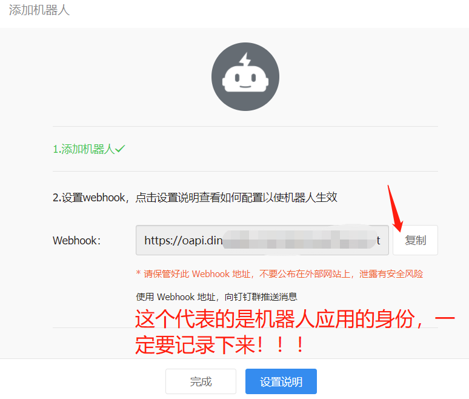

## 安装Python3环境

```shell
[root@zabbix-server ~]# yum -y install zlib-devel bzip2-devel openssl-devel ncurses-devel sqlite-devel readline-devel tk-devel gdbm-devel db4-devel libpcap-devel xz-devel libffi-devel gcc make

[root@zabbix-server ~]# wget https://www.python.org/ftp/python/3.7.4/Python-3.7.4.tgz
```

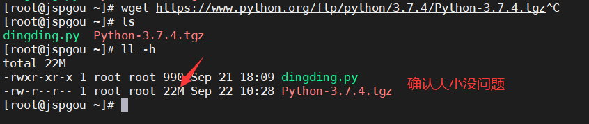

```shell
[root@zabbix-server ~]# mkdir -p /usr/local/python3

[root@zabbix-server ~]# tar xvzf Python-3.7.4.tgz
[root@zabbix-server ~]# cd Python-3.7.4

[root@python Python-3.7.4]# ./configure --prefix=/usr/local/python3/
[root@python Python-3.7.4]# make && make install
[root@python Python-3.7.4]# ln -s /usr/local/python3/bin/python3.7 /usr/bin/python3

[root@python Python-3.7.4]# ln -s /usr/local/python3/bin/pip3.7 /usr/bin/pip3
[root@python Python-3.7.4]# python3 -V
[root@python Python-3.7.4]# pip3 -V
```

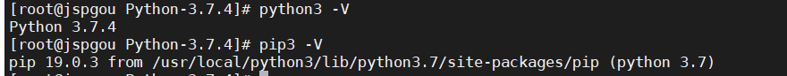

## 创建报警脚本

```shell
[root@zabbix-server ~]# cd /usr/lib/zabbix/alertscripts
[root@zabbix-server alertscripts]# vim dingding.py
#!/usr/bin/env python3
#coding:utf-8
#zabbix钉钉报警
import requests,json,sys,os,datetime
webhook="https://oapi.dingtalk.com/robot/send?access_token=d3f1f891b45215fe63fdc9caddebf236746fd1d3642cfff2e79318e533933d43"
user=sys.argv[1]
text=sys.argv[3]
data={
    "msgtype": "text",
    "text": {
        "content": text
    },
    "at": {
        "atMobiles": [
            user
        ],
        "isAtAll": False
    }
}
headers = {'Content-Type': 'application/json'}
x=requests.post(url=webhook,data=json.dumps(data),headers=headers)
if os.path.exists("/var/log/zabbix/dingding.log"):
    f=open("/var/log/zabbix/dingding.log","a+")
else:
    f=open("/var/log/zabbix/dingding.log","w+")
f.write("\n"+"--"*30)
if x.json()["errcode"] == 0:
    f.write("\n"+str(datetime.datetime.now())+"    "+str(user)+"    "+"发送成功"+"\n"+str(text))
    f.close()
else:
    f.write("\n"+str(datetime.datetime.now()) + "    " + str(user) + "    " + "发送失败" + "\n" + str(text))
    f.close()
[root@zabbix-server alertscripts]# chmod +x dingding.py
```

## 安装python-pip和requests库

```shell
[root@zabbix-server alertscripts]# yum -y install epel-release
[root@zabbix-server alertscripts]# yum -y install python-pip
[root@zabbix-server alertscripts]# pip3 install requests
```

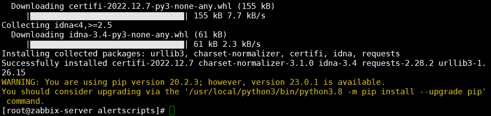

```plain
[root@zabbix-server ~]# touch /var/log/zabbix/dingding.log
[root@zabbix-server ~]# chown zabbix.zabbix /var/log/zabbix/dingding.log
```

## 测试脚本是否可行

```shell
[root@zabbix-server alertscripts]# ./dingding.py test  test  "问题"
```

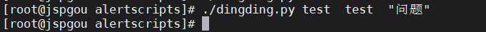

```shell
pc端接收成功：
```

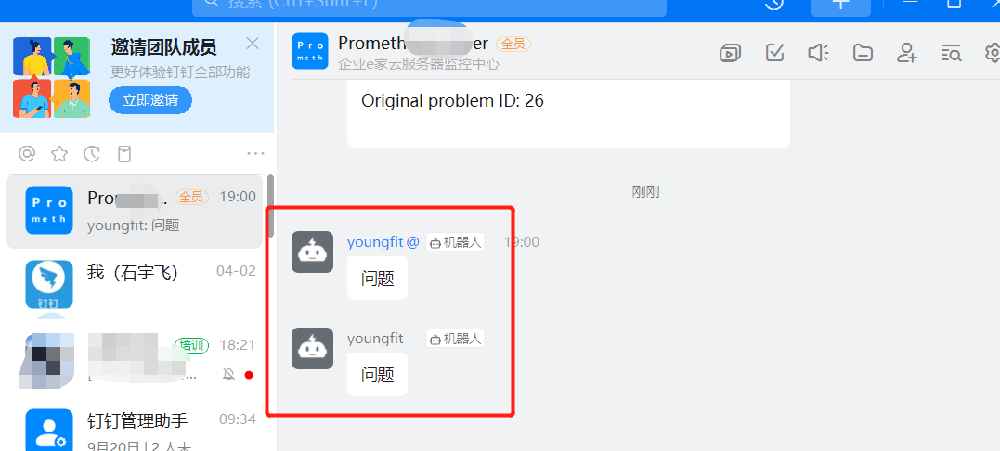

```shell
移动端App接收成功：
```


#### 创建新的报警媒介

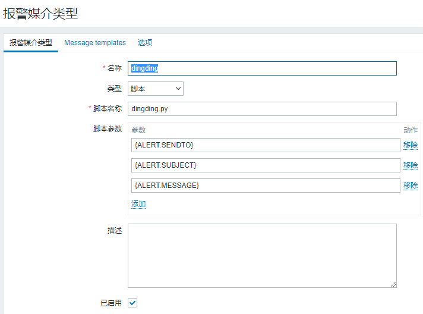

```plain
主机: {HOST.NAME1}
时间: {EVENT.DATE} {EVENT.TIME}
级别: {TRIGGER.SEVERITY}
触发: {TRIGGER.NAME}
详情: {ITEM.NAME1}:{ITEM.KEY1}:{ITEM.VALUE1}
状态: {TRIGGER.STATUS}
项目：{TRIGGER.KEY1}
事件ID：{EVENT.ID}
```

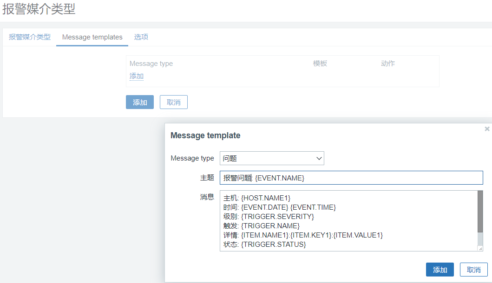

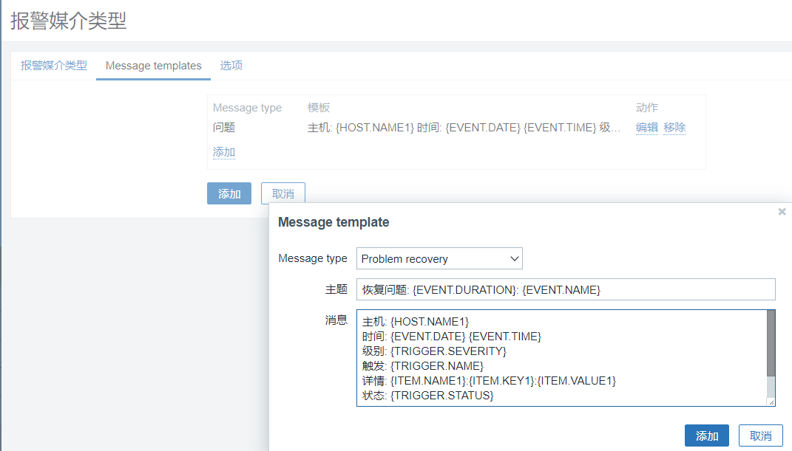

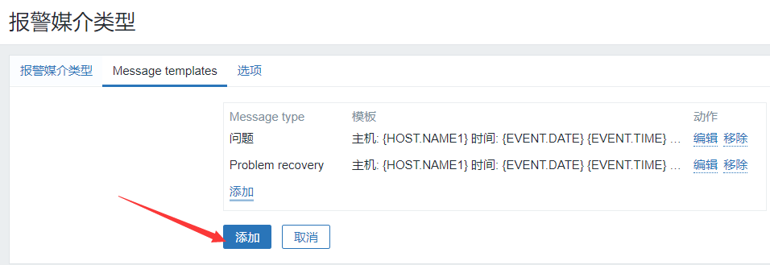

#### 关联媒介

```shell
将asuka用户关联到此媒介：
```

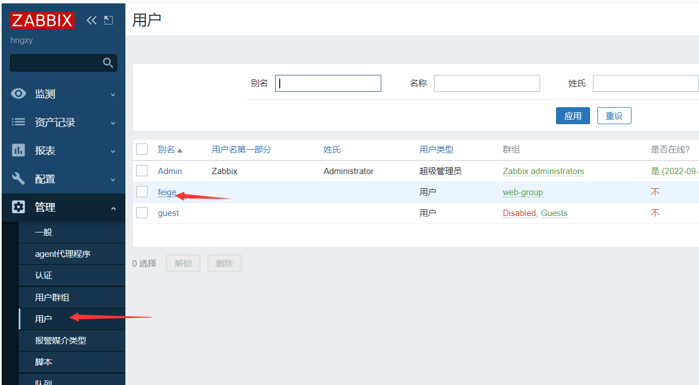

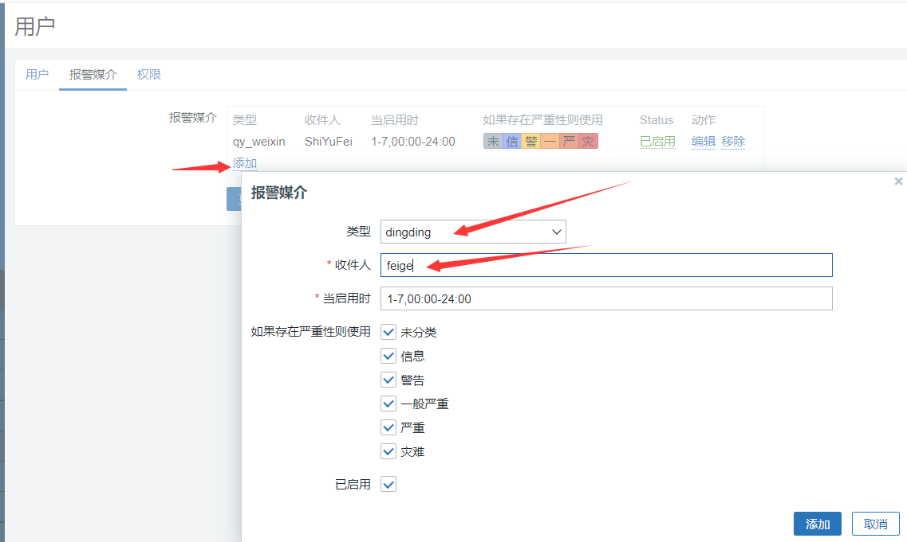

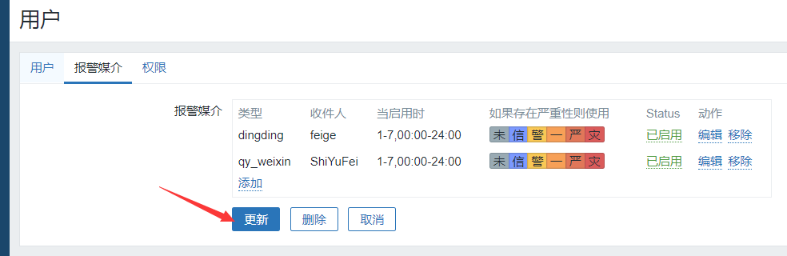

#### 创建监控项

```shell
监听的仍然是82端口号
```

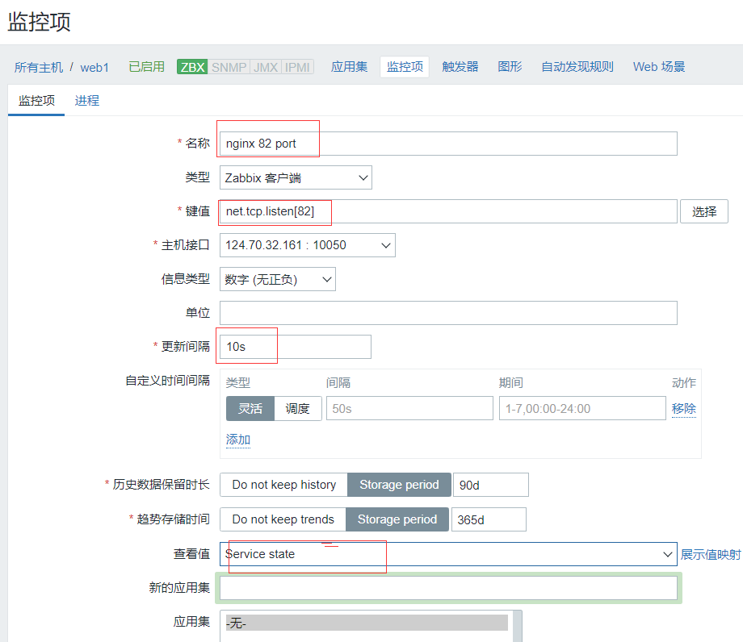

然后点击下面的"添加"

#### 创建触发器

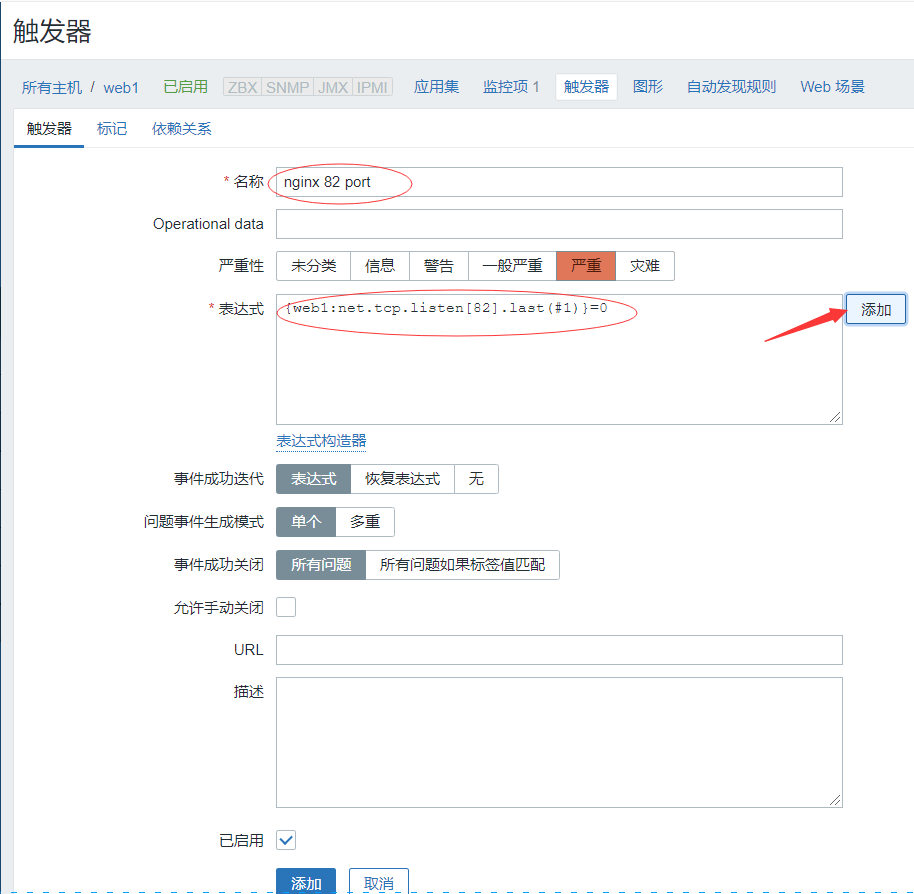

#### 设置动作

这里直接更改一下动作里面的媒介，看效果更快捷

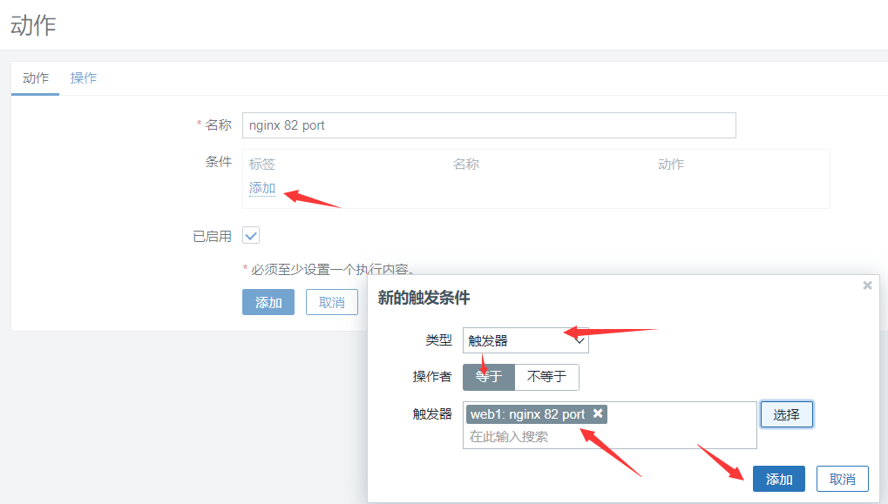


#### 钉钉报警测试

```shell
[root@zabbix-agent-node2 ~]# systemctl stop nginx
PC端接收成功：
```


```shell
移动端APP接收成功：
```


```plain
[root@zabbix-agent-node2 ~]# systemctl start nginx
```


