前提条件：

监控端，正在监控被监控端的http 80端口；设置触发器，我这里没有显示而已。

## 监控内容

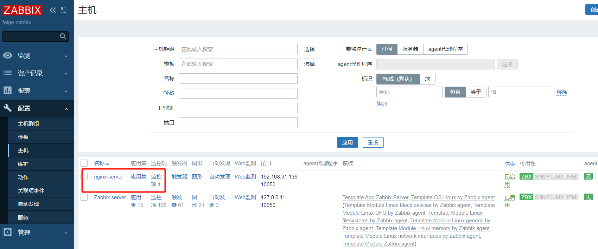

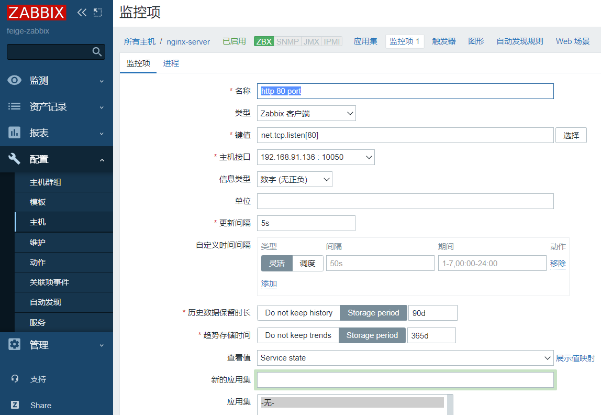

## 使用睿象云

https://www.aiops.com/ 睿象云

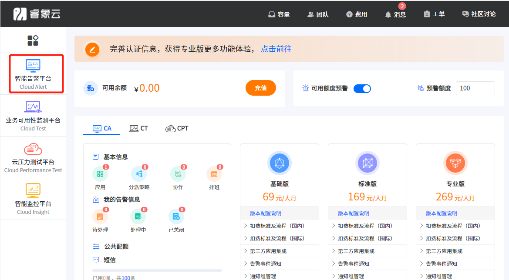

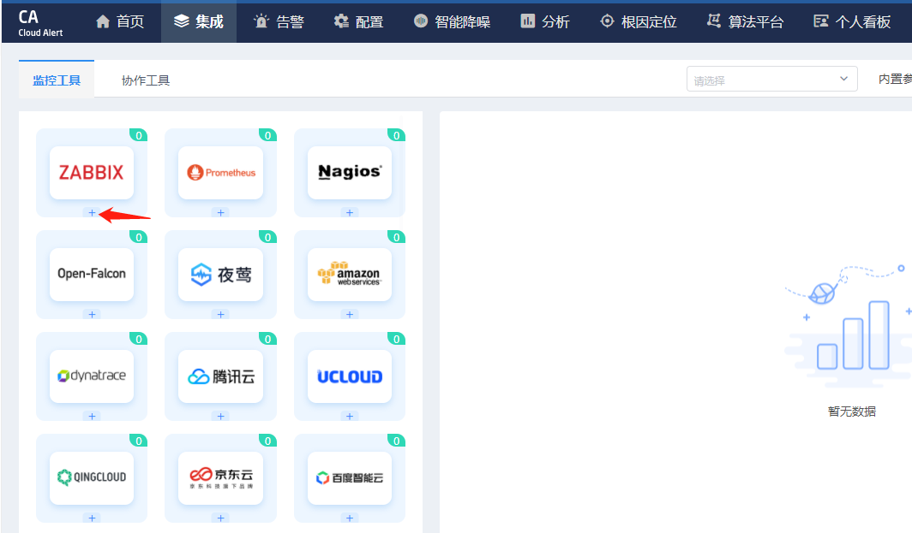

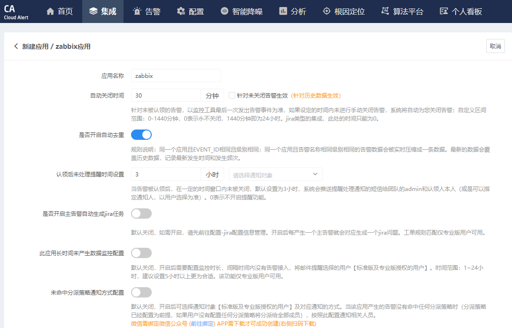

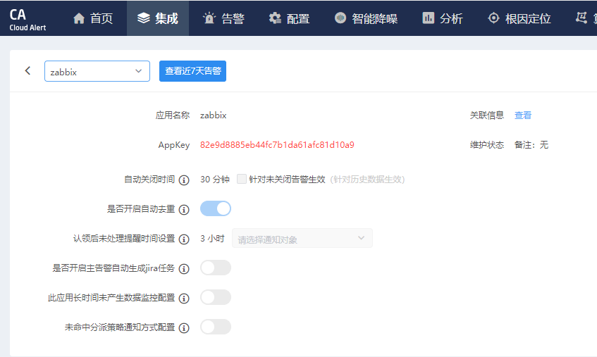

应用名称：zabbix

AppKey：82e9d8885eb44fc7b1da61afc81d10a9

注意目录是zabbix目录：/usr/lib/zabbix/alertscripts

```shell
一、安装 Agent
1、切换到zabbix脚本目录 (注意查看自己的zabbix存放脚本的目录)：
cd /usr/local/zabbix-server/share/zabbix/alertscripts

2、获取Cloud Alert Agent包：
wget https://download.aiops.com/ca_agent/zabbix/ca_zabbix_release-4.0.1.tar.gz

3、解压、安装。
tar -xzf ca_zabbix_release-4.0.1.tar.gz
cd cloudalert/bin
bash install.sh {appKey}
注：1、在安装过程中根据安装提示，输入zabbix管理地址、管理员用户名、密码。

 2、zabbix管理地址正确示例：http://zabbix.server.com/zabbix 或是：https://zabbix.server.com/zabbix

4、修改运行zabbix服务权限与cloudalert探针目录权限
请保证运行zabbix服务的权限和cloudalert探针目录的权限保持一致，不一致会导致告警无法正常接入。

5、验证告警集成
产生新的zabbix告警(problem)，动作状态为“已送达”表示集成成功。
```

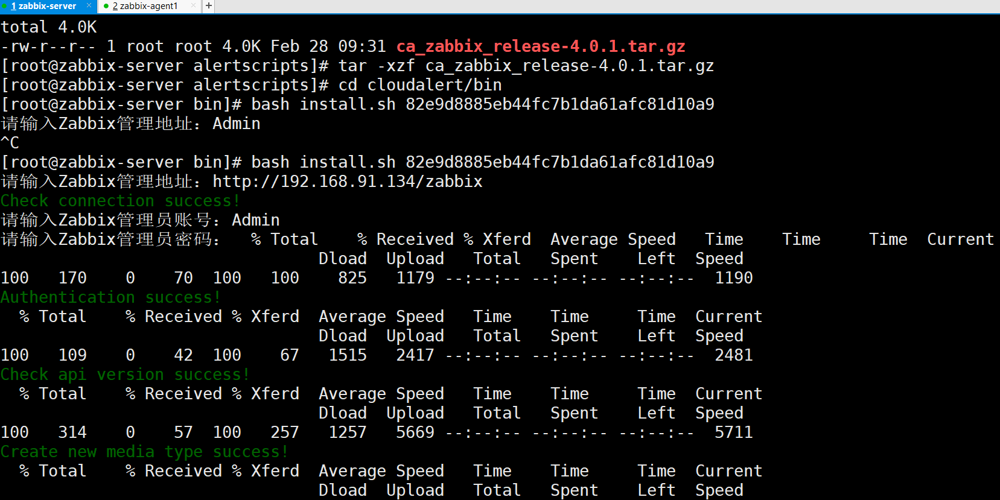

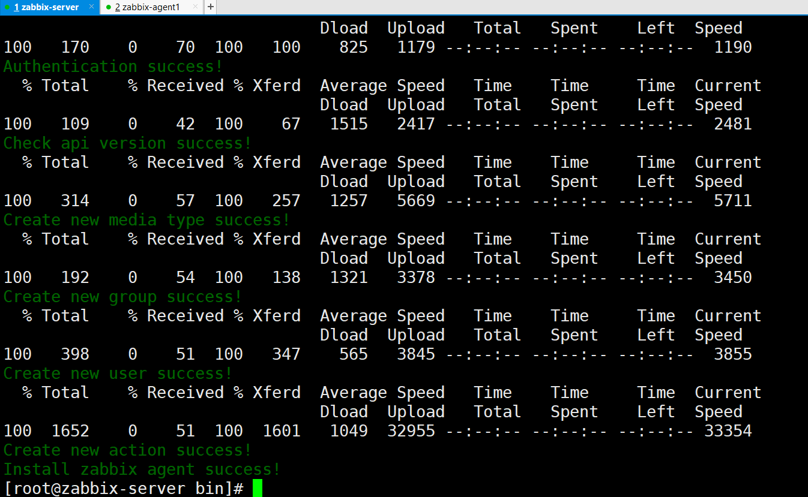

安装完成之后，会生成zabbix新的用户和报警媒介：

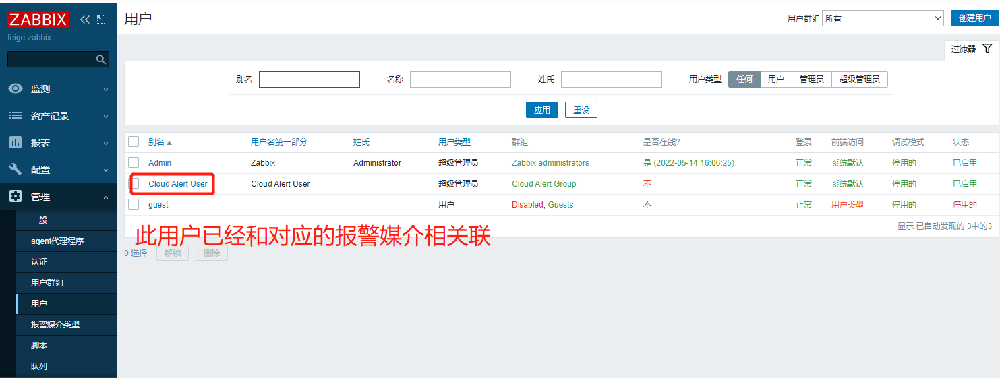

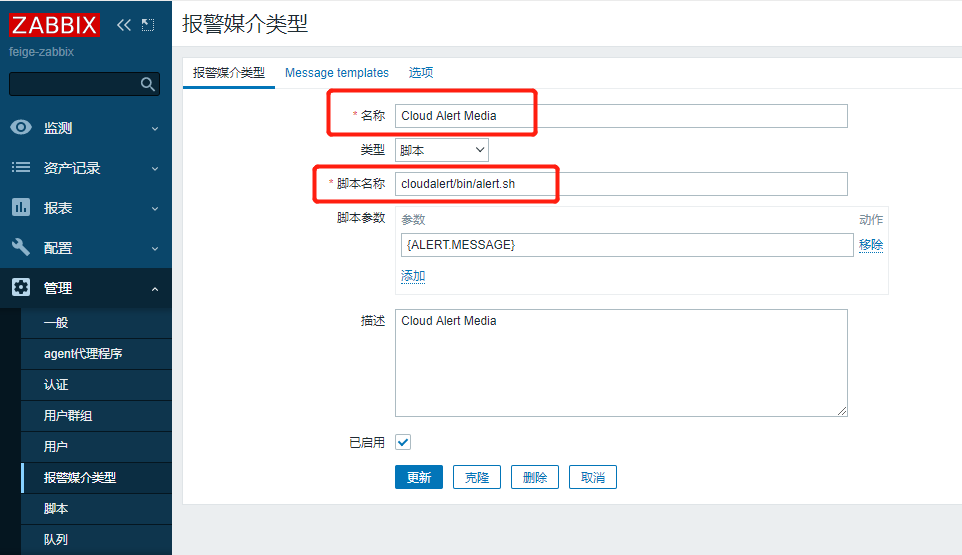

## 分配策略

分配策略：什么类型的报警发送到哪个用户

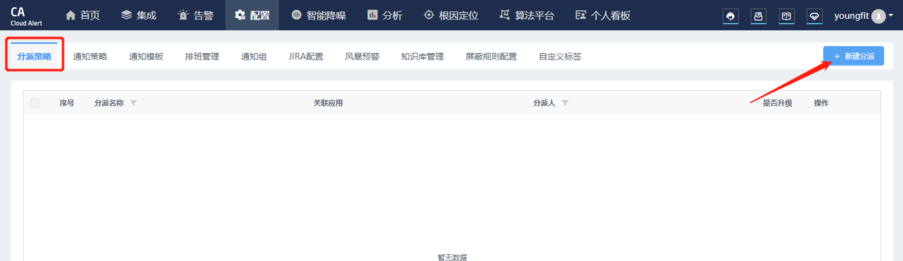

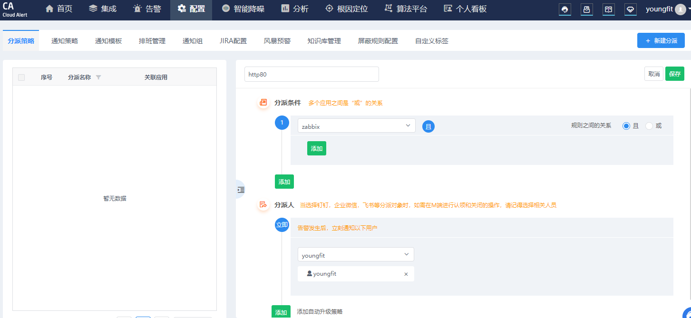

## 通知策略

通知策略：采用什么方式进行通知

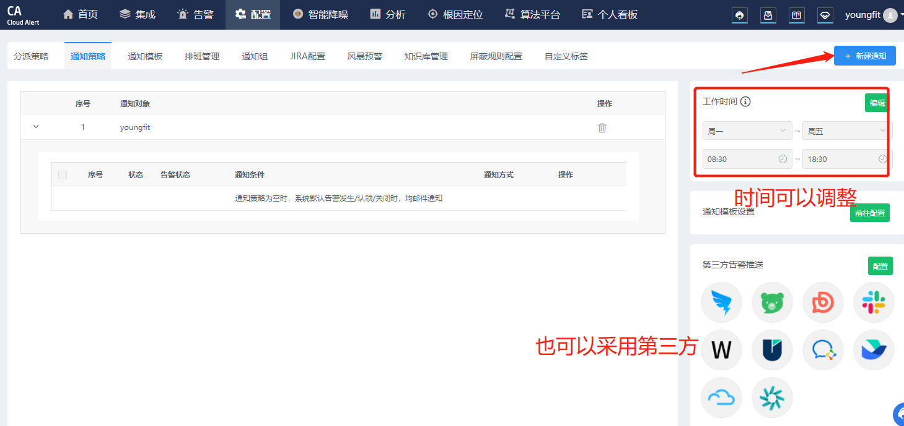

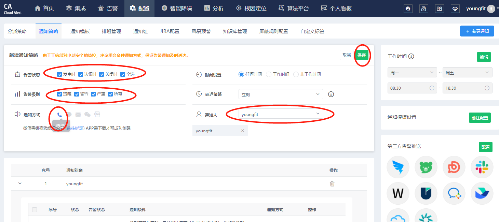

## Zabbix添加动作

关联触发器

发送到 Cloud Alert User 组 和 Cloud Alert User 用户

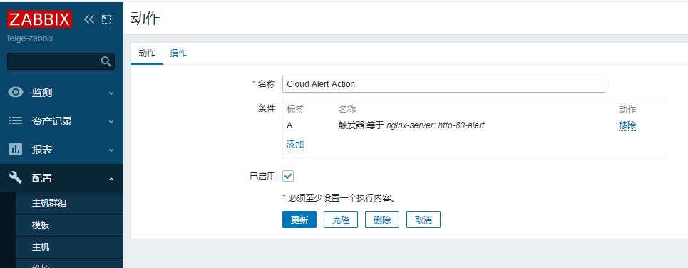

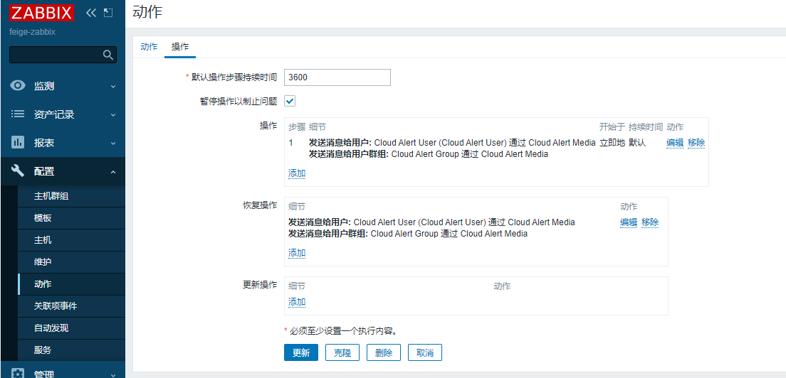

测试报警

```shell
[root@zabbix-agent1 ~]# systemctl stop httpd
```

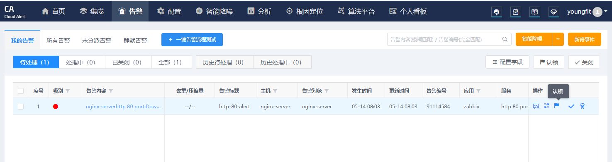

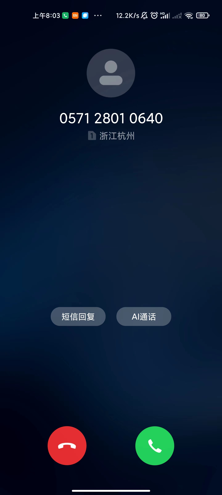