## Grafana简介

Grafana 是 Graphite 和 InfluxDB 仪表盘和图形编辑器。Grafana 是开源的，功能齐全的度量仪表盘和图形编辑器，支持 Graphite，InfluxDB 和 OpenTSDB。

Grafana 主要特性：灵活丰富的图形化选项；可以混合多种风格；支持白天和夜间模式；多个数据源；Graphite 和 InfluxDB 查询编辑器等等。

因为zabbix本身自带的图形比较少，不能满足我们的需求。所以，我们可以安装grafana来配合zabbix出图，让数据更加直观、形象地体现出来。

Grafana官网：https://grafana.com/

## Granfana下载

官网下载方法：https://grafana.com/grafana/download?edition=oss

选择开源版本，我这里和zabbix-server安装在一台虚拟机

```shell
[root@zabbix-server ~]# wget https://dl.grafana.com/oss/release/grafana-8.3.4-1.x86_64.rpm
[root@zabbix-server ~]# yum -y install grafana-8.3.4-1.x86_64.rpm
[root@zabbix-server ~]# systemctl start grafana-server
# 日志位置
[root@zabbix-server ~]# tail -f /var/log/grafana/grafana.log
```

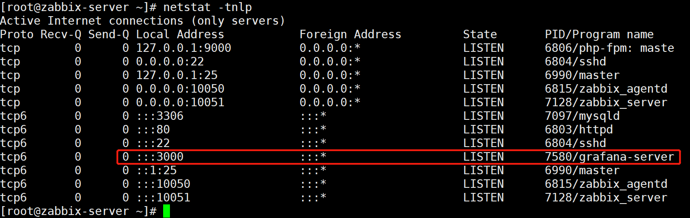Granfana官网文档：https://grafana.com/docs/grafana/latest/getting-started/getting-started/

首次登录 Grafana：

1. 打开您的网络浏览器并转到 http://localhost:3000/。3000除非您配置了不同的端口，否则Grafana 侦听的默认 HTTP 端口是。
2. 在登录页面上，输入admin用户名和密码（默认admin）。
3. 单击**登录**。如果登录成功，您将看到更改密码的提示。
4. 在提示上单击“**确定**”，然后更改您的密码。
5. 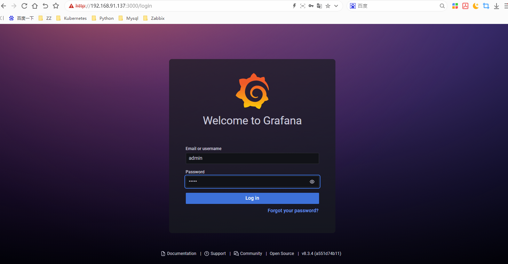

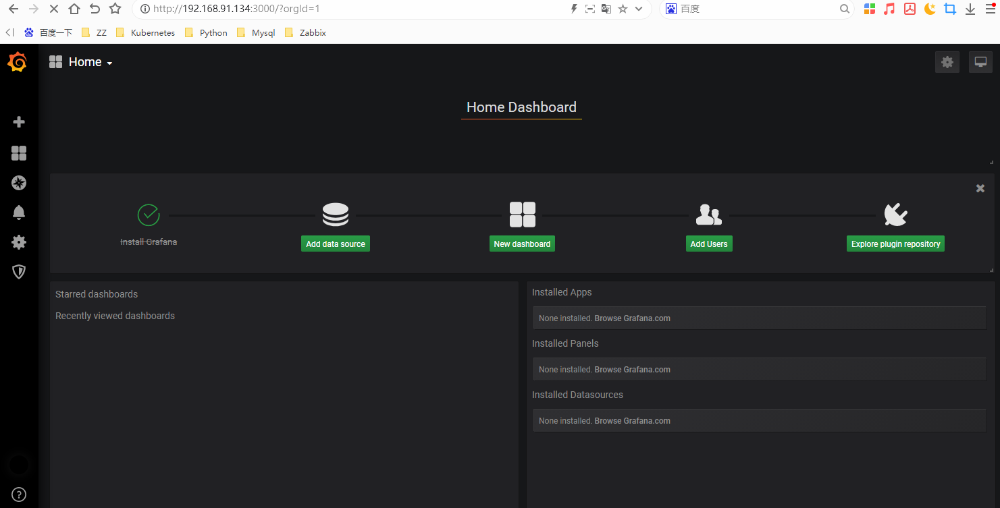

## 下载连接zabbix的插件

https://grafana.com/grafana/plugins/?utm_source=new-data-source&search=zabbix

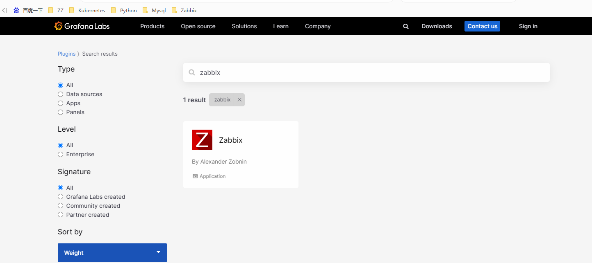

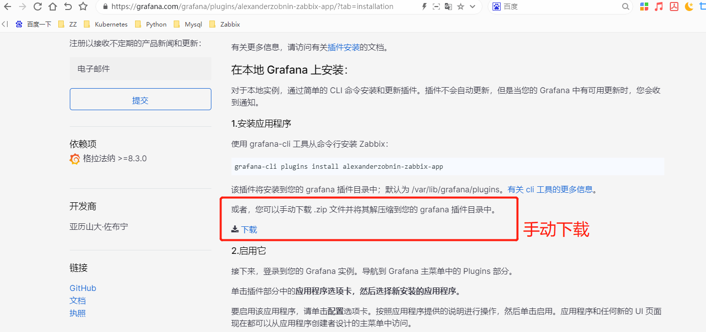

```shell
[root@grafana-server ~]# grafana-cli -h

# 是从github上下载，下载失败。多次尝试。不行尝试下载到本地，上传虚拟机。手动解压
# 我就是手动的
第一种方法：
[root@grafana-server ~]# grafana-cli plugins list-remote
[root@grafana-server ~]# grafana-cli plugins list-remote|grep -i zabbix
[root@grafana-server ~]# grafana-cli plugins install alexanderzobnin-zabbix-app
```

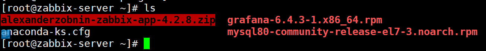

```shell
# 第二种方法
[root@grafana-server ~]# cp alexanderzobnin-zabbix-app-4.2.8.zip  /var/lib/grafana/plugins/
[root@grafana-server plugins]# unzip alexanderzobnin-zabbix-app-4.2.8.zip
[root@grafana-server ~]# systemctl restart grafana-server
```

## Grafana开启Zabbix插件

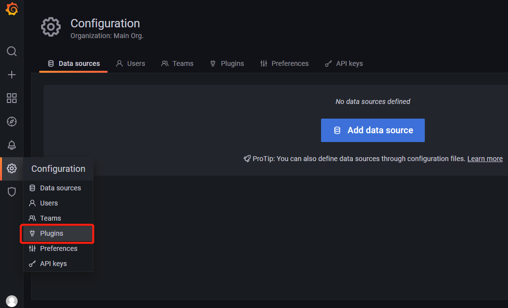

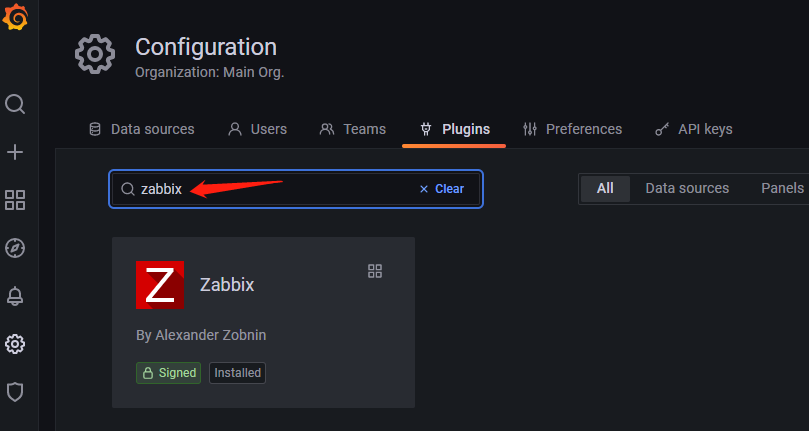

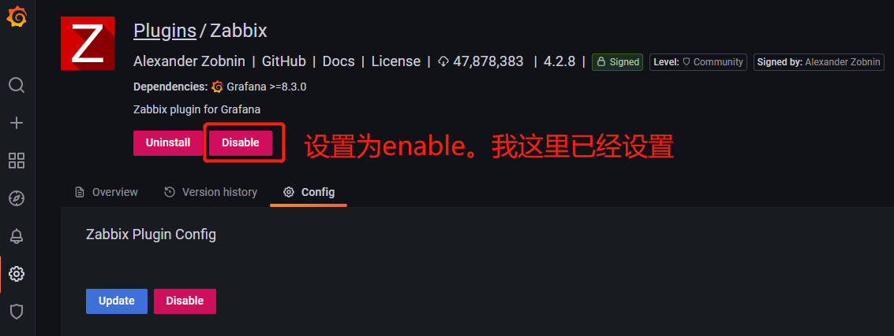

## 配置zabbix数据源

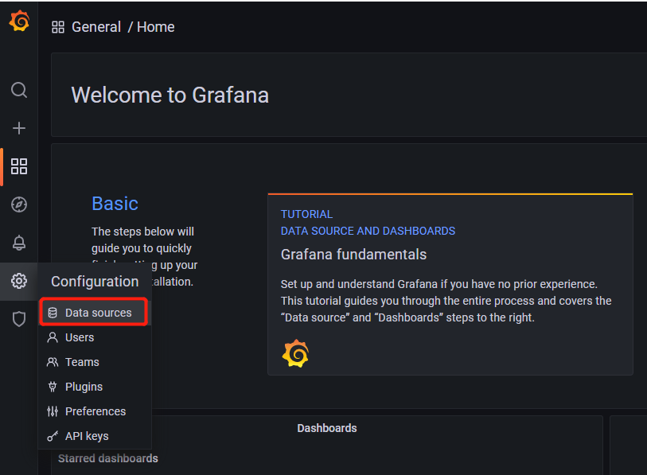

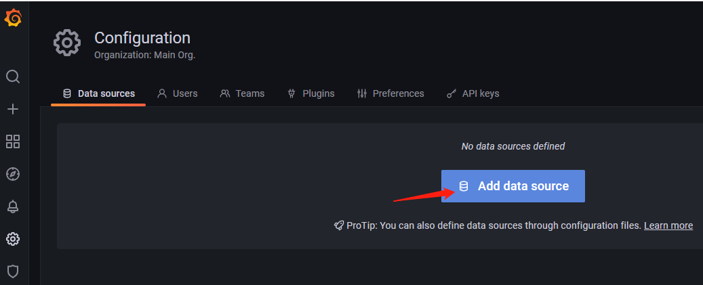

往下拉，自己安装的插件zabbix在最下面

http://192.168.91.134/zabbix/api_jsonrpc.php

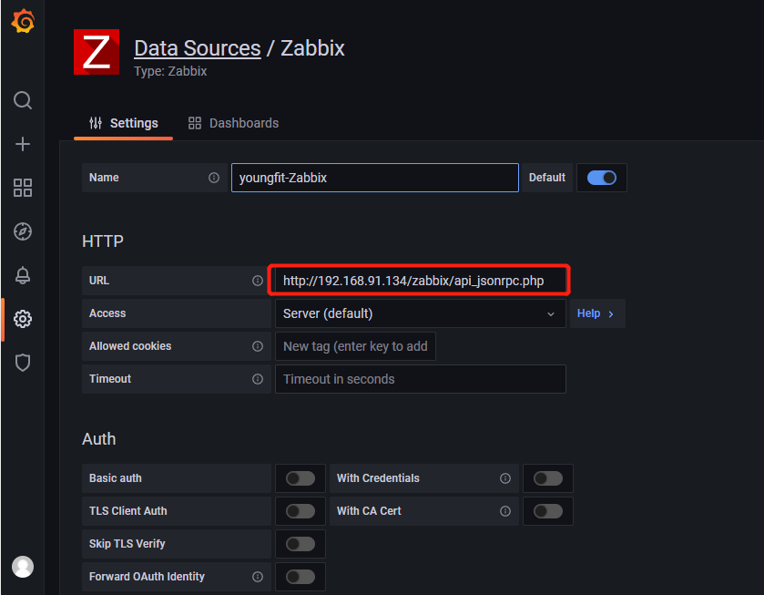

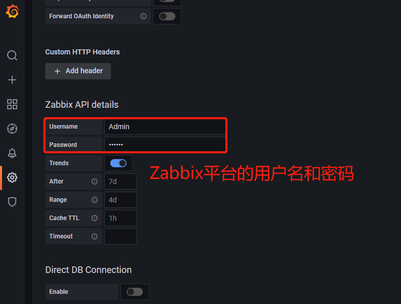

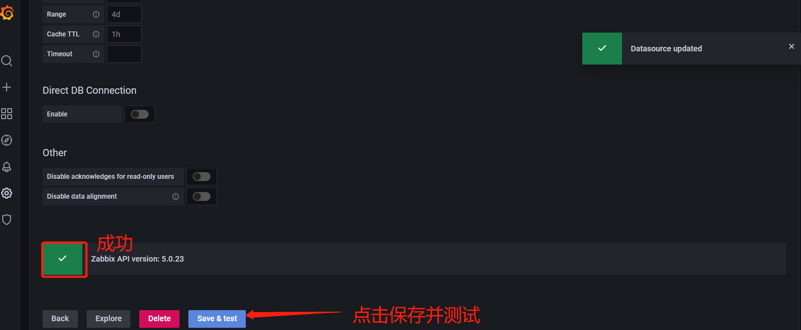

```shell
Name：自定义一个名称
Type： 下拉框中选择zabbix   #如果没有安装zabbix插件，此处则没有zabbix选项
URL：http://zabbix-serverIP/zabbix/api_jsonrpc.php   #zabbixAPI接口地址
Access: 默认Server(Default)，表示grafana直接到Server取数据，brower表示让每个客户端单独获取，一般不用。
Username：填写你zabbix的用户名
Password： 填写你zabbix用户名的密码
Trends：勾选
```

## Grafana可视化Zabbix数据

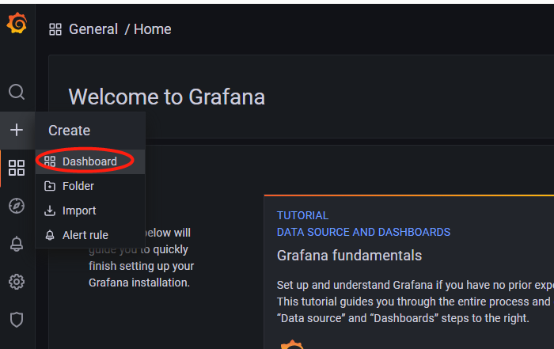

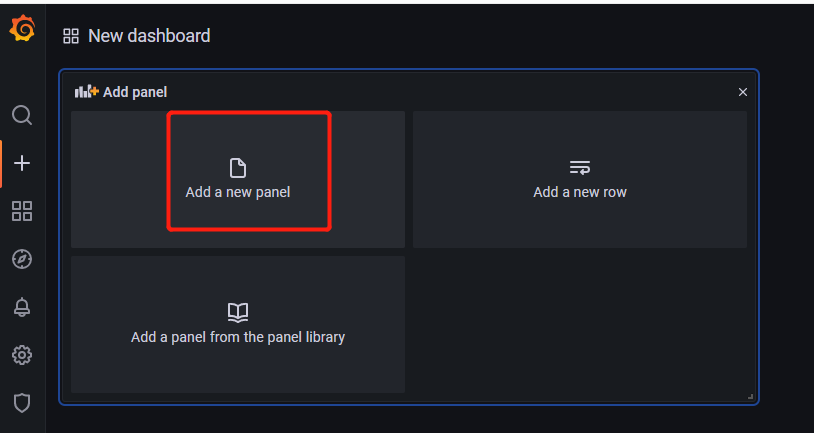

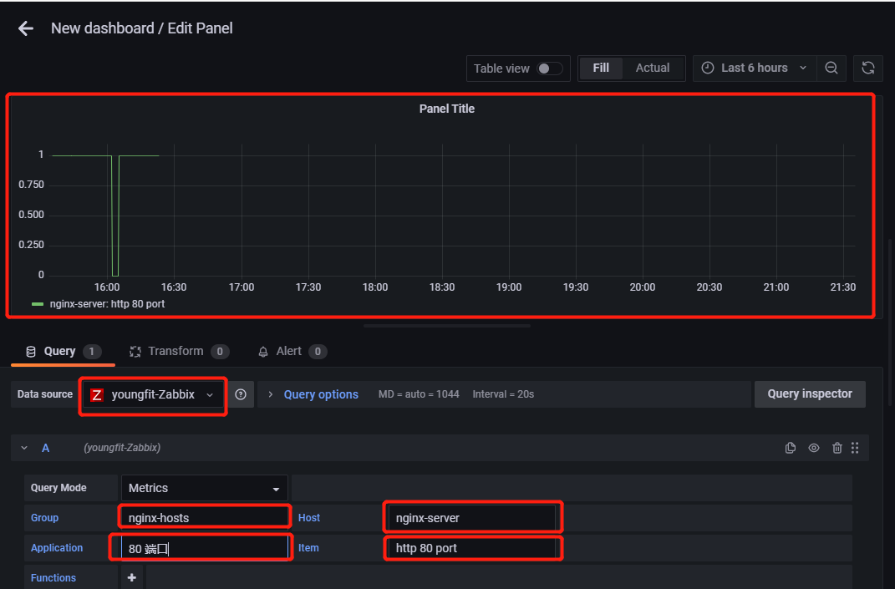

如没有以上选项，重启grafana-server，再次测试

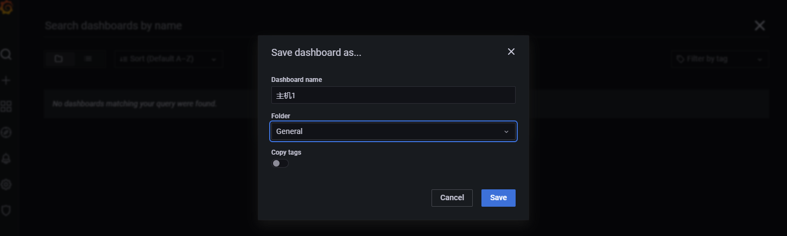

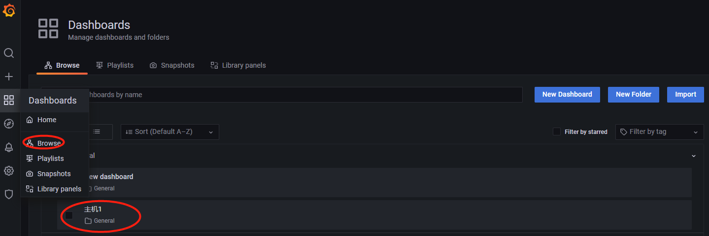

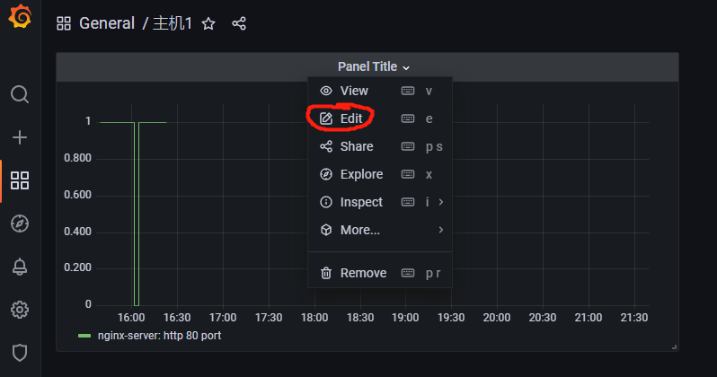

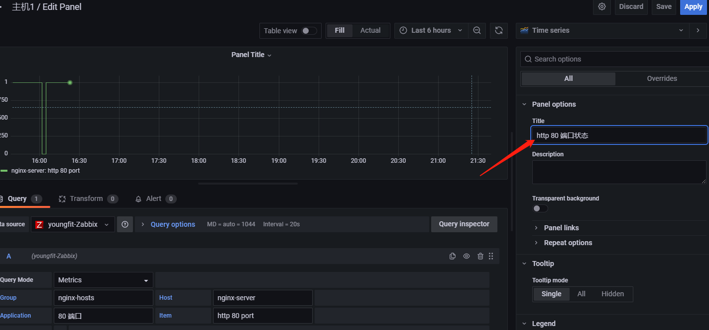

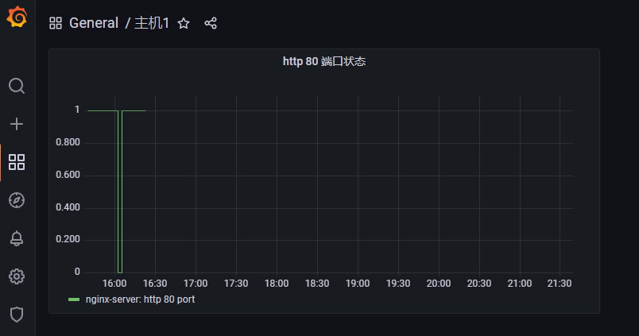